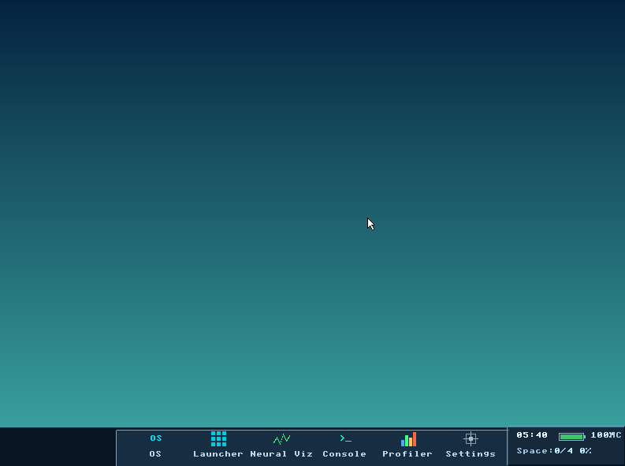
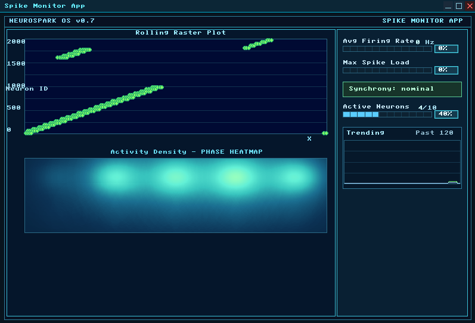
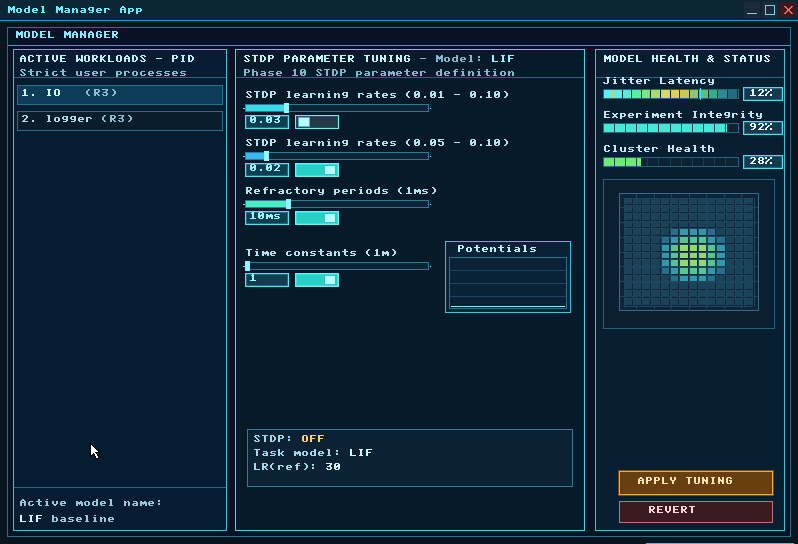

<div align="center">
  
  <h1>NeuroSpark OS</h1>
  <p><b>A Neuromorphic-First Operating System for Edge AI</b></p>

  [](#)
  [](#)
  [](#)
</div>

---

## 🧠 What is NeuroSpark?

**NeuroSpark** is an experimental, bare-metal operating system written entirely from scratch in C and Assembly. Unlike traditional operating systems (Linux, Windows) that run AI frameworks in bloated user-space runtimes, NeuroSpark embeds a **Spiking Neural Network (SNN)** and an **AI Inference Engine** directly into the kernel's lowest level (Ring 0).

It was designed to explore a radically new architecture for edge computing: what if the OS *itself* was intelligent? What if hardware interrupts could feed directly into biological-style neural synapses with zero context-switching overhead?

## ✨ Features

- **Neuromorphic Kernel Engine:** Native support for Spiking Neural Networks (SNNs) and Spike-Timing-Dependent Plasticity (STDP) for real-time unsupervised learning.
- **Ring 0 AI Runtime:** Loads and executes neural models (TinyLLM) natively within the kernel using a custom AI task scheduler.
- **Axiom Console:** A powerful, POSIX-style terminal shell with 77 root commands and **193 total operations** spanning hardware drivers, neural networks, AI inference, networking, and more.
- **Custom Hardware Drivers:** 
  - Native **USB xHCI** (Extensible Host Controller Interface) for keyboards, mice, and mass storage.
  - Native **AHCI** (SATA) driver for bare-metal disk IO.
  - Native **AC97 Audio** driver capable of realtime neural "sonification" (converting spikes into audio).
- **NeuroDock GUI:** A completely custom, lightweight Window Manager written from scratch with a beautiful macOS-inspired glassmorphic floating dock, isometric design cues, and procedural vector icons.
- **Ext2 Virtual File System (VFS):** Full support for reading and writing to standard Linux Ext2 partitions.

---

## 📸 Screenshots

<p align="center">
  
</p>
<p align="center">
  
</p>
<p align="center">
  
</p>

---

## 🛠️ Building & Running

NeuroSpark is designed for the x86 architecture and boots via GRUB/Multiboot.

### Prerequisites
- `gcc` (with 32-bit cross-compilation support `gcc-multilib`)
- `nasm` (Netwide Assembler)
- `qemu-system-i386` (For virtualization)
- `make`

### Build Instructions
```bash
# Clean previous builds
make clean

# Compile the kernel
make

# Run the OS in QEMU
make run
```

---

## 🚀 The Architecture

NeuroSpark abandons traditional OS design paradigms in favor of an AI-centric approach. 

1. **The Core (`kernel/kernel.c`)**: Initializes the GDT, IDT, Paging, and the Physical/Virtual Memory Managers.
2. **The Neuromorphic Pipeline (`kernel/pipeline_graph.c`)**: Acts as a software-emulated neuro-processor. Hardware interrupts (like moving a USB mouse) can be mapped directly to stimulate "neurons" in the kernel.
3. **The AI Scheduler (`kernel/ai_scheduler.c`)**: A QoS-aware scheduler that shares CPU cycles between standard POSIX tasks (like the GUI) and heavy forward-pass AI inference operations without causing system hangs.

---

## 📖 Documentation
Check out the **[USER_GUIDE.md](USER_GUIDE.md)** for the complete reference of all **77 root commands and 193 total operations** available in the Axiom Console, organized into 23 categories from memory inspection (`memstat`) to neural network visualizers (`viz heatmap`) to AI model training (`ai train start`).

---

## 📜 License
NeuroSpark is open-source and released under the **MIT License**. We encourage researchers, hobbyist OS developers, and AI enthusiasts to fork, modify, and experiment with the code!
